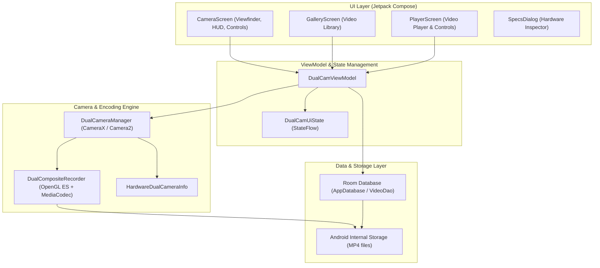

# DualCam 📷🎥

[](https://github.com/zerokid/Android-Dual-Camera/releases)
[](https://github.com/zerokid/Android-Dual-Camera/actions/workflows/release.yml)
[](https://www.android.com)
[](https://kotlinlang.org)
[](https://developer.android.com/jetpack/compose)

**DualCam** is a modern, high-performance Android application designed for simultaneous dual-camera video recording. Built with **Jetpack Compose**, **Material 3**, and **CameraX Concurrent Streams**, it captures both front and rear cameras in real time and compiles them into a single, unified composite MP4 video with synchronized audio.

Whether you are creating reaction videos, vlogs, interviews, tutorials, or dual-perspective event recordings, DualCam provides a seamless, real-time multi-view recording experience.

---

## 🌟 Key Features

### 1. 🔄 Concurrent Dual Camera Capture
- Streams both the **front (selfie)** and **rear (environment)** cameras simultaneously on supported Android devices using CameraX and Android Camera2 concurrent stream APIs.
- Seamless lens switching between primary and secondary feeds.

### 2. 📐 Multiple Dynamic Split Layouts
Switch between composition layouts on the fly without interrupting your preview:
- **Split Vertical (50:50)**: Top and bottom stacked half-screen views.
- **Split Horizontal (50:50)**: Side-by-side split screen perspective.
- **Picture-in-Picture (PiP)**: Floating reaction camera that can be positioned in any of the four corners (Top-Right, Top-Left, Bottom-Right, Bottom-Left).
- **Director Mode (70:30)**: Cinema-style 70% primary subject view with a 30% inset reaction cam.

### 3. 🎨 Real-Time Video Filters
Enhance your video feeds with real-time visual color tuning:
- **Normal**: Natural color grading.
- **Vivid**: High saturation and punchy contrast.
- **Cinematic**: Warm film-like color profile.
- **B&W Noir**: High-contrast dramatic monochrome.
- **Cyber Cyan**: Stylized futuristic cyan-teal tint.

### 4. ⚡ 60 FPS High Frame Rate & 30 FPS Toggle
- **Smooth 60 FPS Recording**: One-tap toggle between **30P** and **60P** directly in the top control bar.
- **Hardware AE Target Synchronization**: Automatically tunes Camera2 auto-exposure target FPS range (`[30, 60]`) on supported camera sensors.
- **High-Bitrate Encoding**: Employs an elevated 8 Mbps video encoding pipeline with strict 16.6ms frame timestamps to eliminate motion jitter in fast-action sequences.
- **Live FPS Status**: Real-time FPS badge embedded in the recording timer bar so you always know your active capture speed.

### 5. 🔍 Pinch-to-Zoom & Torch Control
- **Interactive Multi-Touch Zoom**: Smooth pinch-to-zoom gesture directly on the camera viewfinder.
- **Live HUD Zoom Badge**: Real-time indicator displaying the active zoom magnification level.
- **Integrated Flashlight/Torch**: Toggle flashlight for rear camera recording in low-light environments.

### 6. 🎙️ Live Audio Metering & Synchronized Encoding
- **Real-Time VU Level Meter**: Dynamic audio level bar tracking microphone amplitude and decibel input while recording.
- **Accurate Duration Counter**: Live time counter displaying hours, minutes, and seconds of the active take.
- **Hardware-Accelerated Composite Pipeline**: Uses OpenGL ES (GLES20/EGL14) rendering and Android `MediaCodec` (H.264/AVC video + AAC audio) with `MediaMuxer` to produce synchronized MP4 files directly on-device.

### 7. 🛠️ Hardware Diagnostics & Camera Inspector
- Built-in **Hardware Specs Dialog** that inspects your phone's camera hardware capabilities:
  - Concurrent camera streaming support (`availableConcurrentCameraInfos`)
  - Detected front and rear camera hardware IDs
  - Sensor hardware level and total optical camera count

### 8. 🎬 Integrated Video Gallery & Custom Player
- **In-App Library**: Browse all recorded dual-camera videos sorted by creation date with file sizes and duration metadata.
- **Custom Video Player**: Full-featured video player with seek slider, pause/play, replay, and loop playback.
- **Native Android Sharing**: Share recorded MP4 videos directly to social media, messaging apps, or cloud storage via Android `FileProvider`.

### 9. 🔒 100% Offline & Privacy-First
- Zero external tracking, zero server uploads, and no user account required.
- All video recording, composition, and storage operations are executed entirely on your device.

---

## 🏗️ Architecture & Tech Stack

DualCam is architected according to modern Android development best practices:



| Component | Technology |
|---|---|
| **Language** | Kotlin 2.2.10 |
| **UI Framework** | Jetpack Compose (BOM 2024.09.00) with Material Design 3 |
| **Architecture** | MVVM (Model-View-ViewModel) + unidirectional data flow |
| **Camera Framework** | Android CameraX 1.5.0 (`camera-camera2`, `camera-lifecycle`, `camera-view`) |
| **Video Composition** | OpenGL ES (GLES20 / EGL14) surface blending |
| **Media Encoding** | Android `MediaCodec` (H.264 video, AAC audio) + `MediaMuxer` |
| **Database** | Room 2.7.0 (with KSP annotation processing) |
| **Concurrency** | Kotlin Coroutines & StateFlow |
| **Build System** | Gradle 9.3.1 + Android Gradle Plugin (AGP) 9.1.1 |
| **Target SDK** | Android 16 (API 36) |
| **Minimum SDK** | Android 7.0 (API 24) |

---

## 📱 Hardware Requirements & Device Compatibility

- **Concurrent Camera Support**: Simultaneous front and back camera capture requires device hardware and vendor HAL support for Android concurrent camera streaming (`FEATURE_CAMERA_CONCURRENT`).
  - *Supported devices include*: Google Pixel 6 and newer, Samsung Galaxy S21/S22/S23/S24 series, Samsung Galaxy Z Fold / Z Flip series, and select modern flagship models from Xiaomi, OnePlus, and Motorola.
- **Single-Camera Fallback**: On devices that do not support concurrent hardware streaming, DualCam automatically identifies hardware limitations and provides single-camera recording with full filter, zoom, and audio metering features.

---

## 📥 Download & Installation

### Option 1: Download Pre-built APK (Direct)
You can download the latest installable release directly from GitHub:

➡️ **[Download Latest APK from Releases](https://github.com/zerokid/Android-Dual-Camera/releases/latest)**

1. Download `DualCam-v*.apk` to your Android device.
2. When prompted by Android, tap **Install** (allow installation from your browser if prompted).
3. Open **DualCam** and grant the requested Camera and Microphone permissions.

---

## 🛠️ Building from Source

### Prerequisites
- **Android Studio** (Ladybug / Meerkat or newer recommended)
- **JDK 21**
- **Android SDK** with API level 36 (Android 16) installed

### Build Steps

1. **Clone the repository**:
   ```bash
   git clone https://github.com/zerokid/Android-Dual-Camera.git
   cd Android-Dual-Camera
   ```

2. **Setup environment file**:
   ```bash
   cp .env.example .env
   ```

3. **Build Debug APK**:
   ```bash
   ./gradlew assembleDebug
   ```
   The APK will be generated at `app/build/outputs/apk/debug/app-debug.apk`.

4. **Build Release APK**:
   ```bash
   ./gradlew assembleRelease
   ```
   The APK will be generated at `app/build/outputs/apk/release/app-release.apk`.

5. **Install directly to a connected Android device via ADB**:
   ```bash
   ./gradlew installDebug
   ```

---

## 🚀 Automated CI/CD Releases (GitHub Actions)

DualCam is equipped with an automated GitHub Actions release workflow ([`.github/workflows/release.yml`](.github/workflows/release.yml)).

- **Publish a New Release**: Simply push a semantic version tag:
  ```bash
  git tag v1.0.1
  git push origin v1.0.1
  ```
- **Manual Trigger**: Go to the **[Actions tab](https://github.com/zerokid/Android-Dual-Camera/actions/workflows/release.yml)** in GitHub and run the workflow with a single click.
- **Automatic Signing**: The pipeline automatically signs every APK release (using either your secret production keystore or an automated self-signed release key) so users can install APKs immediately without manual signature steps.

---

## 🛡️ Permissions Used

| Permission | Purpose |
|---|---|
| `android.permission.CAMERA` | Required to preview and capture video feeds from front and rear cameras. |
| `android.permission.RECORD_AUDIO` | Required to record synchronized microphone audio during video capture. |

---

## 🤝 Contributing

Contributions, feature requests, and bug reports are welcome!
Feel free to open an [Issue](https://github.com/zerokid/Android-Dual-Camera/issues) or submit a [Pull Request](https://github.com/zerokid/Android-Dual-Camera/pulls).

---

## 📄 License

This project is open-source under standard public repository terms. See repository files for details.
